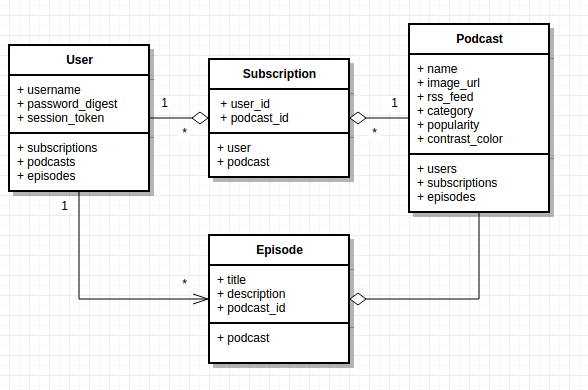

# CommuteCasts ReadMe

CommuteCasts is a podcast sreaming app that is inspired by Bandcamp. It utilizes
Ruby on Rails handle the data and business layers,
and React/Redux for the presentation-layer.

Check it out live at: [SITE URL GOES HERE]

## Features

#### Core Feature Integration
- [ ] Users should be allowed to Browse through podcast
- [ ] Order podcasts by genre & filter by type
- [ ] Search for specific Podcasts
- [ ] Play / Stream podcasts from RSS feeds
- [ ] Subscribe to Podcasts. View Subscribed Podcasts

#### Bonus Features
- [ ] React-Motion to interpolate between page states
- [ ] Clip Podcasts into sharable URL

## Wireframes
* Index Page
* Podcast Subscriptions Page
* Player & Minimized Player Component
* Podcast Show Page before and after scrolling

## API Endpoints

| Method | End-Point                             | Description |
|:------:|---------------------------------------|------------:|
| GET    | api/podcasts/:id                      | get cast    |
| GET    | api/podcasts?search="Podcast Title"   | search casts|
| GET    | api/podcasts/:id/episodes/:episode_id | get episode |
| POST   | api/users/                            | create user |
| GET    | api/users/:id                         | get user    |
| POST   | api/subscriptions                     | create sub  |
| POST   | api/session                           | sign-in     |
| DELETE | api/session                           | sign-out    |

## DB Schema UML

## Component Hierarchy
* Navbar Container
 * Auth Component
* Player Bar Container
* Discover Component
  * Navbar Container
  * HeroImage Component
  * Search Container
  * ResultsGrid Container
* User Profile Component
  * Genre Component
    * ResultsGrid Container
* Podcast Show Component
  * Episode Container

## Sample state
~~~~
{
  resultGrid: ____,
  player: ____,
  podcast:____
}
~~~~

## Timeline
* Backend, Auth, & API Endpoints, 2 days
* Itunes API, 1 days
* Navbar Container w/ auth, 1 day
* Search Container & ResultsGrid, 2 days
* Genre Component, 1 day
* Player Bar, 2 days
* Episode container, 1 day
